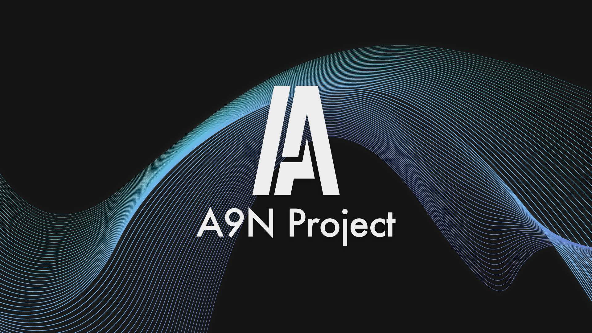

# A9N Microkernel


[](CODE_OF_CONDUCT.md)


A9N is a **Capability-Based Microkernel** that supports a variety of hardware platforms through appropriate **HAL**.  
It is implemented with an object-oriented interface, making it easy to use and extend.  
It combines high portability, stability, and scalability.

## A9N Components list

<pre>
.
├── src
│   ├── kernel
│   ├── hal
│   │    └── include/hal/interface
│   │    └── {ARCH}
│   ├── liba9n
└── test

</pre>

### `src/kernel`

The main hardware-independent part of the A9N microkernel.

### `src/hal`

A Hardware Abstraction Layer (HAL) is implemented to provide a portable interface
to the underlying hardware.  
The {ARCH} directory is referenced during the `make` process.  

### `src/liba9n`

The A9N base library.
Used by the kernel, and HAL.

## Architecture Status

Currently supported architectures:

- x86_64 (Long Mode)

## Requirements

### Kernel

- LLVM 18 or later
  - Clang
  - Clang++
  - LLVM Config
- LLD

### HAL

**x86_64**
- NASM

## Build (with Docker)

### Syntax

```bash
ARCH={target_arch} BUILD_TYPE={Debug|Release} docker compose run --rm a9n-build
```

### Example (x86_64, Release)

```bash
ARCH=x86_64 BUILD_TYPE=Release docker compose run --rm a9n-build
```

## Build (with CMake)

```bash
mkdir build
cmake -B build -DARCH={target_arch} -DCMAKE_TOOLCHAIN_FILE=./src/hal/{target_arch}/toolchain.cmake -DCMAKE_BUILD_TYPE={Debug|Release}
cmake --build build
```
> [!NOTE]
> Currently, the CMake build supports only the kernel binary. 

## How to Use

- [Nun OS Framework](https://github.com/horizon2038/Nun) is a framework for building Operating Systems based on A9N; Written in Rust.
- [A9NLoader](https://github.com/horizon2038/A9NLoader) is a bootloader for A9N-based systems (compatible with *A9N Boot Protocol x86_64*); Written in C w/EDK2.
- [A9NLoader-rs](https://github.com/horizon2038/a9nloader-rs) is a bootloader for A9N-based systems (compatible with *A9N Boot Protocol x86_64*); Written in Rust.

## Author

horizon2k38 ( Rekka "horizon" IGUMI )

Email : horizon "at" sfc.wide.ad.jp  
X : [@horizon2k38](https://x.com/horizon2k38)  
Mastodon : [@horizon2k38@mstdn.jp](https://mstdn.jp/@horizon2k38)  
Misskey : [@horizon](https://misskey.io/@horizon)  

## Acknowledgements

[MITOU JR](https://jr.mitou.org/projects/2023/a9n) : This project was supported by the MITOU Junior program.  
- [@kyasbal](https://github.com/kyasbal) : My mentor during the MITOU Junior program, who provided valuable advice.  
- [@nuta](https://github.com/nuta) : Gave me a advice on the implementation.  

[MITOU IT](https://www.ipa.go.jp/jinzai/mitou/it/2024/gaiyou-sg-2.html) : This project was supported by the MITOU IT program.
- [@sowawa](https://github.com/sowawa) : My mentor during the MITOU IT program, who provided valuable advice.

And I would also like to thank everyone who supported this project.  

<!--
I want to express my heartfelt gratitude to my IDOL, who has been a true source of strength for me :

- Yukiho HAGIWARA
- Nono MORIKUBO
- Nagi HISAKAWA
- Arisu TACHIBANA
- Akira SUNAZUKA
- Tsumugi SHIRAISHI
- Roco HANDA
- Tenka OSAKI
- Koito FUKUMARU
- Lilja KATSURAGI

Thank you so much!
-->

## License

[MIT License](https://choosealicense.com/licenses/mit/)
